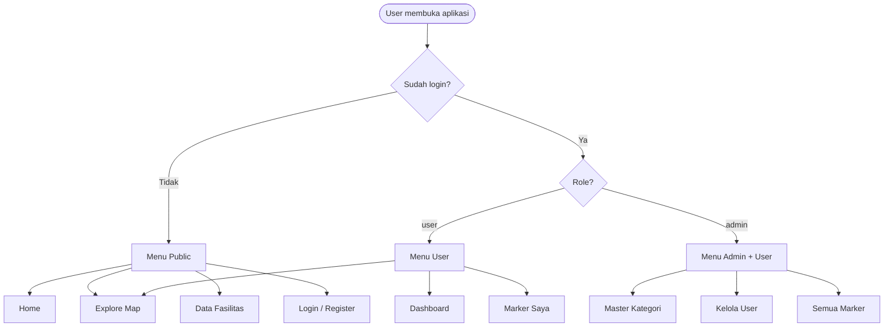
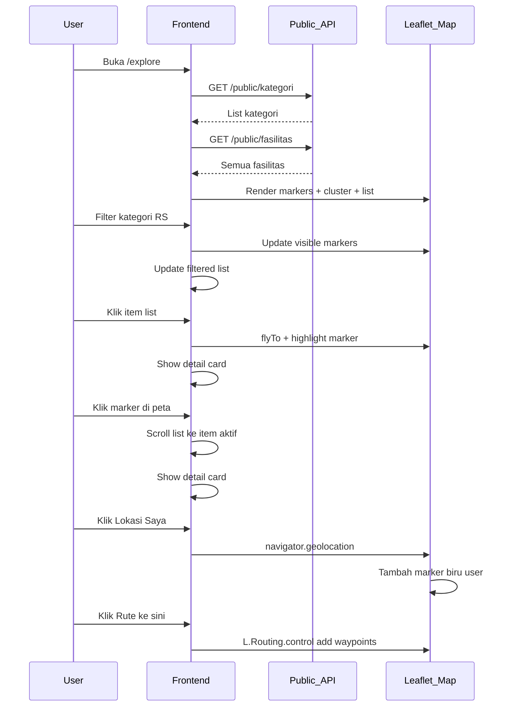
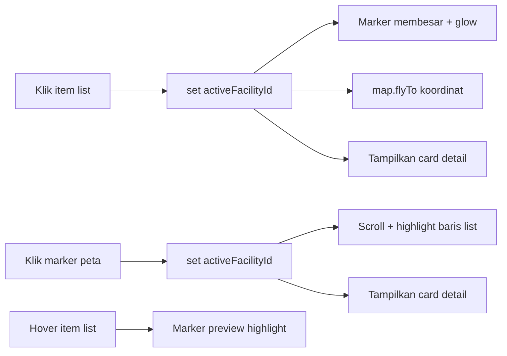
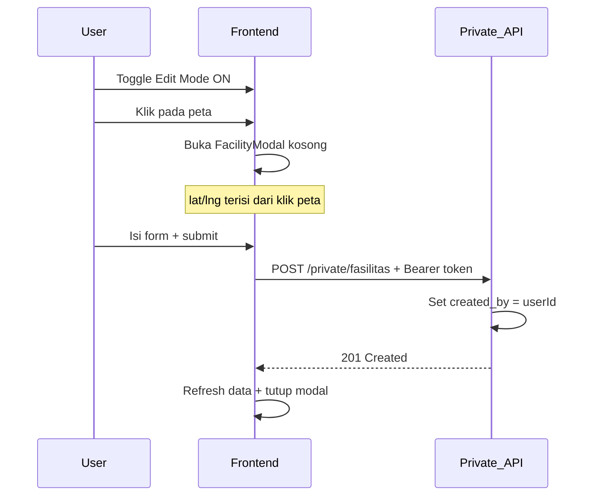
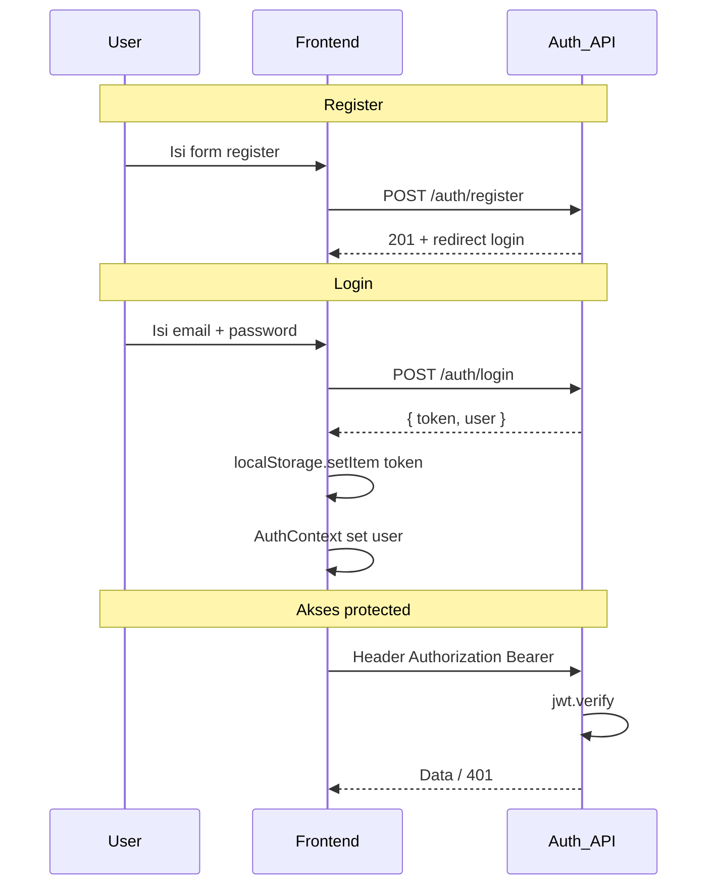

# 03 — SYSTEM FLOW

## HealthMap Bali — Alur Sistem per Skenario

**Versi:** 1.0

---

## 1. Diagram Alur Umum Aplikasi



---

## 2. Skenario A — Public Explore Map

### 2.1 Langkah

| Step | Aktor | Aksi | Sistem |
|------|-------|------|--------|
| 1 | User | Buka `/explore` | Load halaman |
| 2 | Sistem | — | `GET /api/public/kategori` |
| 3 | Sistem | — | `GET /api/public/fasilitas` |
| 4 | Sistem | — | Render peta + cluster + list kiri |
| 5 | User | Pilih filter kategori | Filter map + list realtime |
| 6 | User | Ketik di search | Filter by nama/alamat/kategori |
| 7a | User | Klik item di list | Highlight marker, flyTo, tampilkan card |
| 7b | User | Klik marker di peta | Highlight list item, tampilkan card |
| 8 | User | Klik "Lokasi Saya" | Geolocation → marker biru → flyTo user |
| 9 | User | Klik "Rute ke sini" | Routing Machine: user loc → fasilitas |

### 2.2 Sequence Diagram



### 2.3 State Frontend (Explore Map)

```
activeFacilityId: number | null     // fasilitas terpilih
selectedKategoriIds: number[]        // filter kategori (kosong = semua)
searchQuery: string
userLocation: { lat, lng } | null
editMode: boolean                    // false untuk public
routeTarget: Facility | null
```

---

## 3. Skenario B — Navigasi 2 Arah (List ↔ Marker)

**WAJIB:** interaksi harus sinkron dua arah.



**Implementasi wajib:**
- Satu state global `activeFacilityId` di parent Explore page
- Pass ke `FacilityList` dan `FacilityMarkers` sebagai prop
- CSS class `active` pada marker dan list item yang `id` sama

---

## 4. Skenario C — User Edit Mode

### 4.1 Prasyarat

- User sudah login (`JWT` valid)
- `editMode === true` (toggle di topbar)

### 4.2 Tambah Marker



### 4.3 Edit Marker

| Step | Kondisi | Aksi |
|------|---------|------|
| 1 | Edit Mode ON | User klik marker **milik sendiri** |
| 2 | — | Modal terbuka dengan data terisi |
| 3 | — | `PUT /api/private/fasilitas/:id` |
| 4 | Backend | Cek `created_by === req.user.id` |
| 5 | Bukan pemilik | Response `403 Forbidden` |

### 4.4 Hapus Marker

| Step | Aksi |
|------|------|
| 1 | Konfirmasi dialog "Hapus fasilitas ini?" |
| 2 | `DELETE /api/private/fasilitas/:id` |
| 3 | Backend ownership check |
| 4 | Refresh map + list |

### 4.5 View Mode vs Edit Mode

| Mode | Klik peta | Klik marker orang lain | Klik marker sendiri |
|------|-----------|------------------------|---------------------|
| View | Tidak ada aksi | Tampilkan detail card | Tampilkan detail card |
| Edit | Buka modal tambah | Tampilkan detail saja | Buka modal edit + opsi hapus |

---

## 5. Skenario D — Authentication



---

## 6. Skenario E — Halaman Data Tabular

| Step | Aksi |
|------|------|
| 1 | User buka `/data-fasilitas` |
| 2 | `GET /api/public/fasilitas?page=1&limit=10` |
| 3 | Render tabel: Nama, Kategori, Alamat, BPJS, 24 Jam, Telepon |
| 4 | User search → query param `search` |
| 5 | User filter kategori → `kategori_id` |
| 6 | User klik header kolom → sort `sort=nama_fasilitas&order=asc` |
| 7 | User klik halaman → `page=2` |

**Catatan:** Halaman ini terpisah dari map — memenuhi syarat "tidak hanya data spasial".

---

## 7. Skenario F — Admin

### 7.1 Master Kategori

```
Admin → /admin/kategori
  → GET /api/admin/kategori
  → Tabel kategori + tombol Tambah
  → Modal form: nama_kategori, icon_marker, warna_marker
  → POST / PUT / DELETE /api/admin/kategori/:id
```

### 7.2 Kelola User

```
Admin → /admin/users
  → GET /api/admin/users
  → Edit role / hapus user
  → Tidak boleh hapus akun admin sendiri (opsional safeguard)
```

### 7.3 Semua Marker

```
Admin → /admin/markers
  → GET /api/admin/all-fasilitas
  → Hapus sembarang marker: DELETE /api/admin/fasilitas/:id
  → Tidak perlu ownership check
```

---

## 8. Tabel Visibilitas API (Referensi Cepat)

| Halaman / Konteks | Method | Endpoint | Filter data |
|-------------------|--------|----------|-------------|
| Explore Map | GET | `/public/fasilitas?filter_user=true` | Milik sendiri (jika login user biasa), Semua (jika guest/admin) |
| Data Tabel | GET | `/public/fasilitas` | Semua (+ pagination) |
| Dashboard User | GET | `/private/my-fasilitas` | `created_by = userId` |
| Marker Saya | GET | `/private/my-fasilitas` | `created_by = userId` |
| Edit Mode CRUD | POST/PUT/DELETE | `/private/fasilitas` | Ownership enforced |
| Admin Semua Marker | GET | `/admin/all-fasilitas` | Semua |
| Admin Hapus | DELETE | `/admin/fasilitas/:id` | Tanpa ownership |

---

## 9. Skenario G — Marker Cluster

| Kondisi zoom | Perilaku |
|--------------|----------|
| Zoom rendah (jauh) | Marker digabung jadi cluster circle dengan angka |
| Zoom tinggi (dekat) | Cluster pecah jadi marker individual |
| Klik cluster | Zoom in ke bounds cluster |

**Library:** `leaflet.markercluster` dengan `MarkerClusterGroup` di react-leaflet.

---

## 10. Skenario H — Routing

| Step | Aksi |
|------|------|
| 1 | User pilih fasilitas (card aktif) |
| 2 | User klik "Rute ke Lokasi" |
| 3 | Jika belum ada lokasi user → minta geolocation dulu |
| 4 | Buat `L.Routing.control` waypoints: `[userLatLng, facilityLatLng]` |
| 5 | Tampilkan garis rute di peta |
| 6 | Tombol "Hapus Rute" → remove routing control |

**Router OSRM default** (via Leaflet Routing Machine) — tidak perlu API key.

---

## 11. Error Flow Umum

| Kode | Situasi | UI Response |
|------|---------|-------------|
| 401 | Token expired / tidak ada | Redirect ke login |
| 403 | Edit marker orang lain | Toast error |
| 404 | Fasilitas tidak ditemukan | Pesan not found |
| 422 | Validasi gagal | Tampilkan error per field di modal |
| 500 | Server error | Toast generic error |

---

## 12. Dokumen Terkait

| File | Isi |
|------|-----|
| [04-API-SPECIFICATION.md](./04-API-SPECIFICATION.md) | Detail request/response |
| [06-UI-UX-SPEC.md](./06-UI-UX-SPEC.md) | Perilaku UI visual |

---

*Semua implementasi fitur harus mengikuti alur di dokumen ini.*
