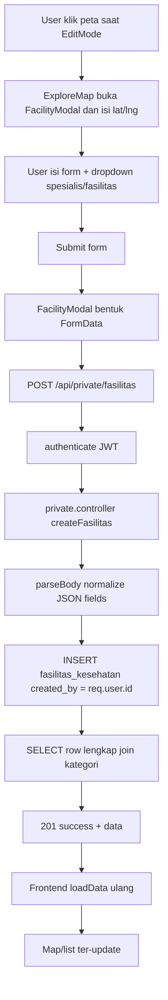

# 08 — PENJELASAN ALUR SISTEM BERDASARKAN KODE

Dokumen ini menjelaskan alur sistem dari kode yang saat ini ada di project, terutama:
- alur halaman peta,
- alur autentikasi,
- alur tambah/edit/hapus marker,
- alur role user/admin,
- alur data master (spesialis dan jenis fasilitas).

---

## 1) Gambaran Arsitektur Runtime

Sistem berjalan dalam 2 aplikasi:
- `frontend` (React + Leaflet.js) sebagai UI/UX.
- `backend` (Express + PostgreSQL) sebagai API dan validasi akses data.

Alur data utama:
1. Frontend memanggil API via `axios` di `src/services/api.js`.
2. Jika ada token login, frontend otomatis kirim `Authorization: Bearer <token>`.
3. Backend memproses route public/private/admin.
4. Backend query PostgreSQL, lalu kirim JSON response.
5. Frontend render peta, list, tabel, modal, dan interaksi user.

---

## 2) Alur Halaman Explore Map (inti sistem)

File utama: `frontend/src/pages/public/ExploreMap.jsx`

### 2.1 Saat halaman dibuka
Fungsi `loadData()` akan dipanggil:
- `GET /public/kategori`
- `GET /public/spesialis`
- `GET /public/jenis-fasilitas`
- `GET /public/fasilitas?limit=500&filter_user=true`

Hasil response disimpan ke state:
- `kategori`
- `masterSpesialis`
- `masterJenisFasilitas`
- `facilities`

### 2.2 Filter dan search
State `filtered` dihitung dari:
- filter kategori (`selectedKategori`)
- pencarian teks (`search`)

Filter dilakukan di client side:
- cocokkan `nama_fasilitas`, `alamat`, `nama_kategori`.

### 2.3 Integrasi list <-> marker
- Klik item list -> set `activeId` -> map flyTo marker.
- Klik marker map -> set `activeId` -> list highlight item aktif.
- Marker aktif juga menampilkan panel detail kanan.

### 2.4 Lokasi user + route
- Tombol `Lokasi Saya` memanggil geolocation browser.
- Jika user klik `Rute ke Lokasi`, komponen map membuat route dari lokasi user ke marker aktif.

---

## 3) Alur Komponen Peta Leaflet

File: `frontend/src/components/map/LeafletMap.jsx`

### 3.1 Inisialisasi map
Sekali saat mount:
- `L.map(...)` + tile OpenStreetMap.
- Buat `markerClusterGroup`.
- Register `map.on('click')`.

### 3.2 Klik peta
Jika `editMode` aktif:
- kirim koordinat klik ke `onMapClick`.
Jika `editMode` tidak aktif:
- clear marker aktif (`onMarkerClick(null)`).

### 3.3 Render marker
Setiap perubahan `facilities`/`activeId`:
- cluster di-clear.
- marker dibuat ulang dari data.
- icon marker dibangun via `buildLeafletDivIcon(...)`.
- marker aktif diberi efek highlight/radar.

### 3.4 Highlight radar + route biru
- Radar pulse ditentukan oleh CSS dan icon html aktif.
- Route style sudah biru (`#4285F4`) dengan garis rounded.

---

## 4) Alur Autentikasi & Token

### Frontend
File: `frontend/src/services/api.js`
- Setiap request cek token di `localStorage`.
- Jika ada token, inject ke header `Authorization`.
- Jika response `401`, token dihapus lalu redirect ke `/login`.

### Backend
File: `backend/src/middleware/auth.middleware.js`
- Middleware `authenticate`:
  - baca header bearer token
  - verifikasi JWT
  - simpan user di `req.user`
- Middleware `requireAdmin`:
  - hanya lolos jika `req.user.role === 'admin'`.

---

## 5) Alur Tambah Marker (yang Anda minta detail)

Ini alur end-to-end dari klik peta sampai data masuk DB.

### Step by step teknis
1. User aktifkan `Edit Mode` di topbar.
2. User klik peta -> `handleMapClick(latlng)` di `ExploreMap`.
3. `editing` diisi lat/lng, lalu `modalOpen=true`.
4. Di `FacilityModal`, user isi:
   - data fasilitas utama,
   - daftar spesialis (dropdown + nama dokter),
   - daftar fasilitas (dropdown + keterangan),
   - foto (opsional).
5. `handleSubmit` membentuk `FormData`:
   - field boolean jadi string `true/false`,
   - `dokter_spesialis` dan `fasilitas` dikirim sebagai JSON string,
   - `atribut_khusus` juga JSON string,
   - file foto dikirim sebagai multipart.
6. Request `POST /api/private/fasilitas`.
7. `private.routes.js` menjalankan:
   - `authenticate`
   - `upload.single('foto')`
   - `createFasilitas`.
8. Controller `createFasilitas`:
   - `parseBody()` convert tipe data,
   - simpan `created_by = req.user.id`,
   - insert ke tabel `fasilitas_kesehatan`.
9. Backend query ulang row lengkap (`FASILITAS_SELECT`) lalu kirim response.
10. Frontend tutup modal dan `loadData()` ulang agar marker langsung tampil.

---

## 6) Alur Edit Marker

1. User pilih marker lalu klik tombol Edit.
2. Modal dibuka dengan data awal (`initial`).
3. Submit -> `PUT /api/private/fasilitas/:id`.
4. Backend route menjalankan `checkOwnership`:
   - admin boleh semua,
   - user biasa hanya jika `created_by` sama dengan `req.user.id`.
5. Jika lolos -> update row, kirim data terbaru.
6. Frontend refresh list/map.

Jika tidak lolos ownership -> `403`.

---

## 7) Alur Hapus Marker

1. User klik delete pada detail.
2. Frontend konfirmasi `window.confirm`.
3. Request `DELETE /api/private/fasilitas/:id`.
4. Backend cek ownership via `checkOwnership`.
5. Jika lolos -> row dihapus.
6. Frontend reload data dan clear `activeId`.

---

## 8) Alur Data Public vs Private

### Public route
File: `backend/src/routes/public.routes.js`
- `/public/kategori`
- `/public/spesialis`
- `/public/jenis-fasilitas`
- `/public/fasilitas`
- `/public/fasilitas/:id`

### Private route
File: `backend/src/routes/private.routes.js`
- `/private/my-fasilitas`
- CRUD fasilitas user login

### Catatan `filter_user=true`
Di `public.controller` saat `GET /public/fasilitas`:
- jika query `filter_user=true` dan ada token user non-admin,
  maka data difilter `created_by = user.id`.
- jika tidak ada token valid, response seperti public biasa (tidak terfilter user).

Jadi perilaku final tergantung query param + token.

---

## 9) Alur Master Data Spesialis dan Jenis Fasilitas

### Public konsumsi master
- Frontend ambil master dari:
  - `GET /public/spesialis`
  - `GET /public/jenis-fasilitas`
- dipakai untuk isi dropdown di modal.

### Admin kelola master
Controller: `backend/src/controllers/master.controller.js`
- Spesialis:
  - GET/POST/PUT/DELETE `/admin/spesialis`
- Jenis fasilitas:
  - GET/POST/PUT/DELETE `/admin/jenis-fasilitas`

UI Admin:
- `frontend/src/pages/admin/AdminSpesialis.jsx`
- `frontend/src/pages/admin/AdminJenisFasilitas.jsx`

---

## 10) Alur Query Database (ringkas)

Builder query: `backend/src/utils/fasilitasQuery.js`
- support filter:
  - `kategori_id`
  - `search` (ILIKE)
  - `created_by`
- support pagination:
  - `page`, `limit`, `offset`
- support sorting:
  - nama fasilitas, kategori, alamat, created_at, rating.

Semua query detail fasilitas memakai `FASILITAS_SELECT` (join `kategori` + `users`).

---

## 11) Ringkasan Fungsi Penting dan Perannya

### Frontend
- `ExploreMap.loadData()` -> ambil seluruh data awal.
- `ExploreMap.handleMapClick()` -> trigger modal tambah marker.
- `ExploreMap.handleSave()` -> create/update marker via API.
- `LeafletMap` -> rendering map/marker/cluster/route.
- `FacilityModal` -> form dinamis + serialisasi JSON + FormData.

### Backend
- `authenticate` -> validasi token.
- `checkOwnership` -> proteksi edit/hapus marker milik sendiri.
- `createFasilitas/updateFasilitas/deleteFasilitas` -> operasi CRUD private.
- `getFasilitasList` -> list dengan filter/sort/pagination.
- `master.controller` -> CRUD master spesialis & jenis fasilitas.

---

## 12) Saran cek cepat untuk memahami sambil run

Jika ingin belajar alurnya sambil debugging:
1. Jalankan backend lalu frontend.
2. Buka devtools network.
3. Coba tambah marker dari peta.
4. Perhatikan urutan request:
   - `POST /private/fasilitas`
   - lalu `GET /public/fasilitas`
5. Cocokkan payload `dokter_spesialis` dan `fasilitas` (JSON string).

Dengan ini Anda bisa melihat langsung hubungan UI -> API -> DB -> UI.

---

## 13) Referensi File + Baris Kode

Berikut indeks cepat agar Anda bisa langsung lompat ke source code.

### 13.1 Frontend (UI dan interaksi)

| Fungsi | File | Baris |
|---|---|---|
| Load data awal halaman explore (`loadData`) | `frontend/src/pages/public/ExploreMap.jsx` | 31-49 |
| Fetch master + fasilitas | `frontend/src/pages/public/ExploreMap.jsx` | 34-43 |
| Filter kategori + search (`filtered`) | `frontend/src/pages/public/ExploreMap.jsx` | 53-68 |
| Geolocation tombol Lokasi Saya (`handleLocate`) | `frontend/src/pages/public/ExploreMap.jsx` | 72-81 |
| Klik peta untuk tambah marker (`handleMapClick`) | `frontend/src/pages/public/ExploreMap.jsx` | 83-93 |
| Simpan marker create/update (`handleSave`) | `frontend/src/pages/public/ExploreMap.jsx` | 95-111 |
| Hapus marker (`handleDelete`) | `frontend/src/pages/public/ExploreMap.jsx` | 113-122 |
| Rules hak edit (`canEdit`) | `frontend/src/pages/public/ExploreMap.jsx` | 124 |
| Wiring komponen peta + route + detail + modal | `frontend/src/pages/public/ExploreMap.jsx` | 137-146, 185-203, 208-217 |
| Inisialisasi Leaflet map + tile | `frontend/src/components/map/LeafletMap.jsx` | 38-49 |
| Cluster marker | `frontend/src/components/map/LeafletMap.jsx` | 51-57 |
| Klik peta (edit mode / clear active) | `frontend/src/components/map/LeafletMap.jsx` | 61-68 |
| Render marker + click marker | `frontend/src/components/map/LeafletMap.jsx` | 91-115 |
| Fly to marker aktif | `frontend/src/components/map/LeafletMap.jsx` | 117-125 |
| Marker lokasi user | `frontend/src/components/map/LeafletMap.jsx` | 127-142 |
| Routing machine + style route biru | `frontend/src/components/map/LeafletMap.jsx` | 144-183 |
| Form modal state init + parse data existing | `frontend/src/components/facility/FacilityModal.jsx` | 31-97 |
| Build payload spesialis/fasilitas JSON | `frontend/src/components/facility/FacilityModal.jsx` | 124-142 |
| Submit FormData ke API | `frontend/src/components/facility/FacilityModal.jsx` | 144-187 |
| Dynamic field kategori (`skema_atribut`) | `frontend/src/components/facility/FacilityModal.jsx` | 40-55, 249-305 |
| Axios inject bearer token | `frontend/src/services/api.js` | 7-13 |
| Auto logout jika 401 | `frontend/src/services/api.js` | 15-27 |

### 13.2 Backend (API dan validasi)

| Fungsi | File | Baris |
|---|---|---|
| Middleware authenticate JWT | `backend/src/middleware/auth.middleware.js` | 4-19 |
| Middleware require admin | `backend/src/middleware/auth.middleware.js` | 21-26 |
| Middleware ownership marker | `backend/src/middleware/ownership.middleware.js` | 3-24 |
| Route private CRUD fasilitas | `backend/src/routes/private.routes.js` | 14-19 |
| Parse body + normalisasi JSON field | `backend/src/controllers/private.controller.js` | 4-32 |
| Create fasilitas (INSERT + created_by) | `backend/src/controllers/private.controller.js` | 34-65 |
| Update fasilitas | `backend/src/controllers/private.controller.js` | 67-107 |
| Delete fasilitas | `backend/src/controllers/private.controller.js` | 109-117 |
| My fasilitas list (owner only) | `backend/src/controllers/private.controller.js` | 119-147 |
| Public kategori (termasuk `skema_atribut`) | `backend/src/controllers/public.controller.js` | 6-16 |
| Public list fasilitas + `filter_user` logic | `backend/src/controllers/public.controller.js` | 18-69 |
| Public detail fasilitas + `filter_user` logic | `backend/src/controllers/public.controller.js` | 71-105 |
| SQL select join + query builder filter/search/sort | `backend/src/utils/fasilitasQuery.js` | 1-72 |

### 13.3 Endpoint master (spesialis & jenis fasilitas)

| Fungsi | File | Baris |
|---|---|---|
| Public route master data | `backend/src/routes/public.routes.js` | 14-18 |
| Controller master (public + admin CRUD) | `backend/src/controllers/master.controller.js` | seluruh file |

Catatan:
- Jika setelah update baris bergeser, gunakan nama fungsi yang sama sebagai penanda utama.
- Referensi di atas berdasarkan snapshot kode saat dokumen ini dibuat.

---

## 14) Kegunaan Tiap Alur/Fungsi (Kenapa Fitur Ini Penting)

Bagian ini menjelaskan **fungsi dipakai untuk apa** dari sisi pengguna dan dari sisi sistem.

### 14.1 Kegunaan di sisi pengguna

| Alur/Fungsi | Kegunaan untuk pengguna |
|---|---|
| Load data awal explore (`loadData`) | User langsung melihat peta, kategori, spesialis, dan jenis fasilitas tanpa setup manual. |
| Filter + search (`filtered`) | Mempercepat menemukan fasilitas yang relevan (mis. hanya Klinik atau cari berdasarkan alamat). |
| List ↔ Marker sinkron (`activeId`) | Memudahkan navigasi data: pilih dari daftar atau peta hasilnya tetap konsisten. |
| Geolocation (`handleLocate`) | User tahu posisi dirinya untuk konteks lokasi fasilitas terdekat. |
| Routing (`showRoute`) | User dapat arahan jalan ke fasilitas tujuan secara visual di peta. |
| Modal tambah/edit marker | Input data lebih fokus dan rapi tanpa pindah halaman. |
| Dropdown spesialis + nama dokter | Data dokter lebih terstruktur dan tidak asal teks bebas. |
| Dropdown fasilitas + keterangan | Detail fasilitas lebih standar, tapi tetap fleksibel dengan catatan tambahan. |
| Radar/highlight marker aktif | User cepat tahu marker mana yang sedang dipilih saat peta padat. |
| Edit/hapus dengan ownership | User hanya bisa mengelola datanya sendiri (aman dari pengubahan oleh user lain). |

### 14.2 Kegunaan di sisi sistem

| Komponen/Fungsi | Kegunaan untuk sistem |
|---|---|
| `api.js` interceptor token | Sentralisasi auth header agar semua request private konsisten. |
| Middleware `authenticate` | Menjamin endpoint private/admin hanya bisa diakses user terverifikasi. |
| Middleware `checkOwnership` | Menegakkan aturan bisnis multi-user di backend (bukan hanya di UI). |
| `parseBody()` + `normalizeJsonField()` | Menjaga bentuk data dari form tetap valid saat disimpan ke DB. |
| `buildListQuery()` | Query list lebih fleksibel (filter/search/sort/pagination) tanpa duplikasi SQL. |
| Master spesialis/jenis fasilitas | Menjaga data referensi konsisten karena dikelola admin, bukan hardcode. |
| `filter_user=true` logic | Memungkinkan mode data yang berbeda (public vs owner) tanpa bikin endpoint baru berlebihan. |
| Marker cluster | Menjaga performa dan keterbacaan peta saat marker banyak. |

### 14.3 Kegunaan untuk pengembangan dan maintenance

| Praktik/Konstruksi | Kegunaan jangka panjang |
|---|---|
| Pemisahan route public/private/admin | Struktur API lebih jelas, mudah di-audit, dan aman. |
| Pemisahan controller per domain | Memudahkan debugging karena tanggung jawab file tidak campur aduk. |
| Komponen reusable (`LeafletMap`, `FacilityModal`, `MasterRowPicker`) | Perubahan UI/fitur lebih cepat tanpa rewrite total. |
| Dokumentasi alur + referensi baris | Memudahkan onboarding tim, demo dosen, dan penelusuran bug. |

### 14.4 Inti manfaat sistem secara keseluruhan

1. **Bagi masyarakat/user:** cepat menemukan fasilitas kesehatan dan rute menuju lokasi.  
2. **Bagi pengelola data:** input data lebih terstandar (master dropdown + struktur JSON).  
3. **Bagi admin:** kontrol penuh terhadap kualitas data master dan user.  
4. **Bagi pengembang:** arsitektur lebih mudah dikembangkan karena alur sudah terpetakan jelas.

