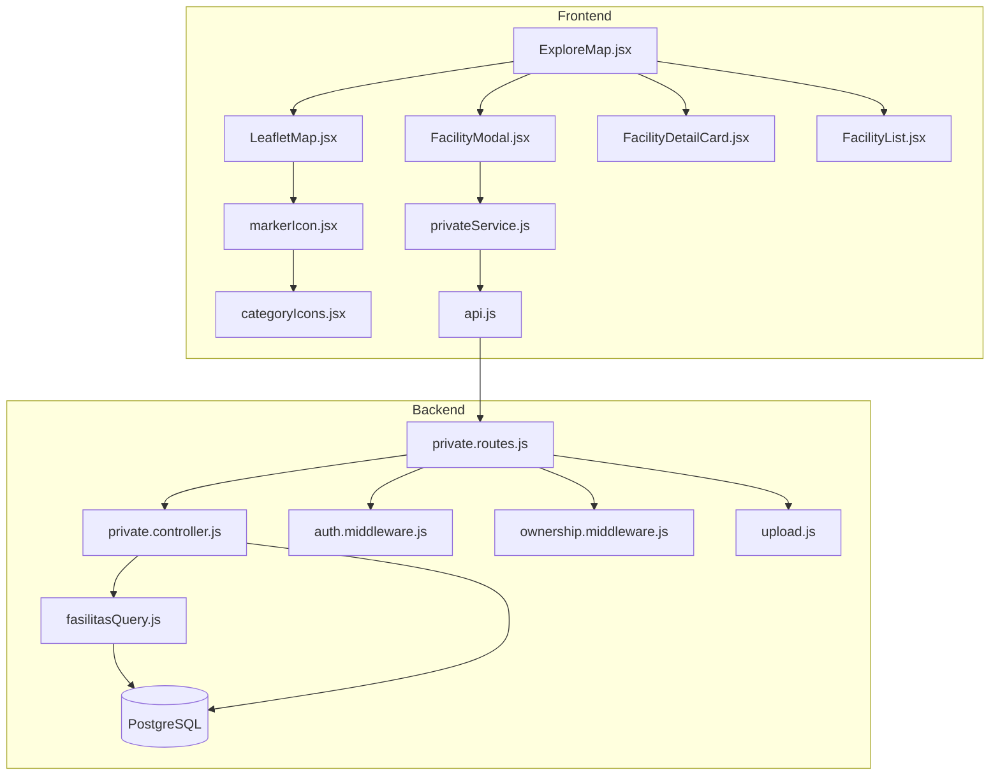

# 10 — PEMETAAN FITUR KE FILE DAN KODE

Dokumen ini menjelaskan **fitur per fitur**: file mana saja yang terlibat, **baris kode** yang relevan, cuplikan logika penting, dan **kegunaan** tiap bagian.

> **Catatan:** Nomor baris mengacu pada kode project saat dokumen ini dibuat. Jika Anda mengubah file, baris bisa bergeser — gunakan pencarian nama fungsi/komponen sebagai acuan utama.

**Dokumen terkait:**
| Dokumen | Isi |
|---|---|
| [08-CODE-FLOW-EXPLANATION.md](./08-CODE-FLOW-EXPLANATION.md) | Alur sistem langkah demi langkah |
| [09-PROJECT-STRUCTURE-EXPLANATION.md](./09-PROJECT-STRUCTURE-EXPLANATION.md) | Struktur folder dan peran file |

---

## Daftar Isi

1. [Fitur Marker (Tampil, Tambah, Edit, Hapus)](#1-fitur-marker-tampil-tambah-edit-hapus)
2. [Fitur Interaksi Peta (Cluster, Routing, Radar, Lokasi)](#2-fitur-interaksi-peta-cluster-routing-radar-lokasi)
3. [Fitur Autentikasi & Otorisasi](#3-fitur-autentikasi--otorisasi)
4. [Fitur Master Data (Spesialis & Jenis Fasilitas)](#4-fitur-master-data-spesialis--jenis-fasilitas)
5. [Fitur Atribut Dinamis per Kategori](#5-fitur-atribut-dinamis-per-kategori)
6. [Fitur Halaman Data Tabel](#6-fitur-halaman-data-tabel)
7. [Fitur Halaman Marker Saya & Admin](#7-fitur-halaman-marker-saya--admin)
8. [Fitur Navigasi & Layout UI](#8-fitur-navigasi--layout-ui)
9. [Penghapusan Atribut Rating](#9-penghapusan-atribut-rating)
10. [Diagram Ketergantungan Fitur Marker](#10-diagram-ketergantungan-fitur-marker)

---

## 1) Fitur Marker (Tampil, Tambah, Edit, Hapus)

Marker adalah representasi visual fasilitas kesehatan di peta. Satu marker = satu record di tabel `fasilitas_kesehatan`.

### 1.1 Menampilkan marker di peta

| Langkah | File | Baris | Kegunaan |
|---|---|---|---|
| Load data fasilitas saat halaman dibuka | `frontend/src/pages/public/ExploreMap.jsx` | 31–49 | Memanggil API dan menyimpan daftar fasilitas ke state `facilities` |
| Filter kategori & pencarian | `frontend/src/pages/public/ExploreMap.jsx` | 53–68 | Menyaring marker yang ditampilkan tanpa memanggil API ulang |
| Kirim data ke komponen peta | `frontend/src/pages/public/ExploreMap.jsx` | 137–146 | Meneruskan `filtered`, `activeId`, callback klik |
| Render marker + cluster | `frontend/src/components/map/LeafletMap.jsx` | 91–115 | Membuat `L.marker` per fasilitas dan menambahkannya ke `markerClusterGroup` |
| Icon marker per kategori | `frontend/src/utils/markerIcon.jsx` | 6–39 | Membangun `divIcon` Leaflet dengan ikon Lucide + warna kategori |
| Mapping ikon kategori | `frontend/src/utils/categoryIcons.jsx` | 14–27 | Menghubungkan `icon_marker` dari DB (mis. `hospital`) ke komponen Lucide |
| Query data dari DB | `backend/src/utils/fasilitasQuery.js` | 1–14 | SQL `SELECT` gabungan fasilitas + kategori + nama pembuat |
| API public list | `backend/src/controllers/public.controller.js` | 18–60 | Endpoint `GET /api/public/fasilitas` dengan filter & paginasi |

**Cuplikan kode — render marker:**

```99:114:frontend/src/components/map/LeafletMap.jsx
    facilities.forEach((f) => {
      const lat = parseFloat(f.latitude);
      const lng = parseFloat(f.longitude);
      if (Number.isNaN(lat) || Number.isNaN(lng)) return;

      const isActive = f.id === activeId;
      const icon = buildLeafletDivIcon(f.icon_marker, f.warna_marker || '#10B981', isActive, L);
      const marker = L.marker([lat, lng], { icon });

      marker.on('click', (e) => {
        L.DomEvent.stopPropagation(e);
        onMarkerClickRef.current?.(f);
      });

      cluster.addLayer(marker);
    });
```

**Kegunaan bagi user:** Masyarakat dapat melihat seluruh fasilitas kesehatan di Bali dalam satu peta interaktif.

---

### 1.2 Sinkronisasi list sidebar ↔ marker

| Langkah | File | Baris | Kegunaan |
|---|---|---|---|
| Daftar fasilitas di sidebar kiri | `frontend/src/components/facility/FacilityList.jsx` | 26–40 | Klik item list → pilih fasilitas |
| Scroll otomatis ke item aktif | `frontend/src/components/facility/FacilityList.jsx` | 14–18 | UX: item yang dipilih terlihat di viewport |
| Set marker aktif dari list | `frontend/src/pages/public/ExploreMap.jsx` | 168–173 | `onSelect` → `setActiveId` |
| Fly-to marker aktif | `frontend/src/components/map/LeafletMap.jsx` | 117–125 | Peta bergerak ke koordinat fasilitas terpilih |
| Panel detail kanan | `frontend/src/components/facility/FacilityDetailCard.jsx` | 18–80 | Menampilkan info lengkap fasilitas aktif |
| Tampilkan panel saat ada `activeFacility` | `frontend/src/pages/public/ExploreMap.jsx` | 182–204 | Panel muncul hanya jika user memilih marker/list |

**Kegunaan:** User bisa memilih fasilitas dari peta **atau** dari daftar — keduanya selalu sinkron.

---

### 1.3 Menambah marker baru

| Langkah | File | Baris | Kegunaan |
|---|---|---|---|
| Toggle mode Edit di topbar | `frontend/src/components/layout/Topbar.jsx` | 71–87 | User login mengaktifkan mode tambah marker |
| Aktifkan edit mode di peta | `frontend/src/pages/public/ExploreMap.jsx` | 129–131, 142 | `editMode && !!user` diteruskan ke `LeafletMap` |
| Klik peta → buka modal | `frontend/src/pages/public/ExploreMap.jsx` | 83–93 | Menyimpan `latitude`/`longitude` dari klik |
| Handler klik peta (Leaflet) | `frontend/src/components/map/LeafletMap.jsx` | 61–67 | Jika `editMode`, kirim `latlng` ke parent |
| Form input fasilitas | `frontend/src/components/facility/FacilityModal.jsx` | 142–185 | Kumpulkan data ke `FormData` lalu submit |
| Service POST | `frontend/src/services/privateService.js` | 5–8 | `POST /api/private/fasilitas` |
| Route + upload foto | `backend/src/routes/private.routes.js` | 17 | Middleware `authenticate` + `upload.single('foto')` |
| Simpan ke DB | `backend/src/controllers/private.controller.js` | 33–64 | `INSERT` + set `created_by` dari JWT |
| Upload file | `backend/src/utils/upload.js` | 1–28 | `multer` simpan foto ke folder `uploads/` |
| Refresh peta setelah simpan | `frontend/src/pages/public/ExploreMap.jsx` | 95–110 | `loadData()` memuat ulang marker |

**Alur singkat:**
```
Topbar [Edit] → klik peta → FacilityModal → FormData
  → POST /api/private/fasilitas → INSERT DB → loadData() → marker baru muncul
```

**Cuplikan kode — buka modal dari klik peta:**

```83:93:frontend/src/pages/public/ExploreMap.jsx
  const handleMapClick = (latlng) => {
    if (!user) {
      alert('Login terlebih dahulu untuk menambah marker');
      return;
    }
    setEditing({
      latitude: latlng.lat.toFixed(6),
      longitude: latlng.lng.toFixed(6),
    });
    setModalOpen(true);
  };
```

**Kegunaan:** User terdaftar dapat menandai lokasi fasilitas kesehatan yang mereka kelola langsung di peta.

---

### 1.4 Mengedit marker

| Langkah | File | Baris | Kegunaan |
|---|---|---|---|
| Cek hak edit (pemilik/admin) | `frontend/src/pages/public/ExploreMap.jsx` | 124 | `canEdit` ditentukan dari `created_by` dan `role` |
| Tombol Edit di detail card | `frontend/src/components/facility/FacilityDetailCard.jsx` | — | Memicu `onEdit` dari parent |
| Buka modal dengan data lama | `frontend/src/pages/public/ExploreMap.jsx` | 199 | `setEditing(activeFacility)` |
| Isi form dari data existing | `frontend/src/components/facility/FacilityModal.jsx` | 55–95 | Parse `atribut_khusus`, spesialis, dll. |
| Service PUT | `frontend/src/services/privateService.js` | 10–13 | `PUT /api/private/fasilitas/:id` |
| Cek kepemilikan | `backend/src/middleware/ownership.middleware.js` | 3–24 | Hanya pemilik atau admin yang boleh edit |
| Update DB | `backend/src/controllers/private.controller.js` | 66–106 | `UPDATE` kolom fasilitas |

**Kegunaan:** Mencegah user mengubah data fasilitas milik orang lain (kecuali admin).

---

### 1.5 Menghapus marker

| Langkah | File | Baris | Kegunaan |
|---|---|---|---|
| Konfirmasi + panggil API | `frontend/src/pages/public/ExploreMap.jsx` | 113–122 | `deleteFasilitas(activeFacility.id)` |
| Service DELETE | `frontend/src/services/privateService.js` | 15 | `DELETE /api/private/fasilitas/:id` |
| Route + ownership | `backend/src/routes/private.routes.js` | 19 | `checkOwnership` sebelum controller |
| Hapus record | `backend/src/controllers/private.controller.js` | 108–116 | `DELETE FROM fasilitas_kesehatan` |

---

## 2) Fitur Interaksi Peta (Cluster, Routing, Radar, Lokasi)

### 2.1 Inisialisasi peta & tile layer

| File | Baris | Kegunaan |
|---|---|---|
| `frontend/src/components/map/LeafletMap.jsx` | 38–49 | Buat `L.map`, tambah tile OpenStreetMap |
| `frontend/src/components/map/LeafletMap.jsx` | 7–8 | Konstanta pusat peta Bali |

---

### 2.2 Marker clustering

| File | Baris | Kegunaan |
|---|---|---|
| `frontend/src/components/map/LeafletMap.jsx` | 51–56 | Inisialisasi `L.markerClusterGroup` |
| `frontend/src/components/map/LeafletMap.jsx` | 97, 113 | `clearLayers()` lalu tambah ulang saat data berubah |

**Kegunaan:** Saat zoom out, marker yang berdekatan digabung agar peta tidak penuh titik.

---

### 2.3 Highlight marker aktif (efek radar)

| File | Baris | Kegunaan |
|---|---|---|
| `frontend/src/utils/markerIcon.jsx` | 14–24 | HTML ring radar saat `isActive = true` |
| `frontend/src/utils/markerIcon.jsx` | 33–38 | Ukuran icon lebih besar saat aktif |
| `frontend/src/index.css` | 43–121 | Animasi `radarPulse`, style pin & ring |

**Cuplikan kode — radar HTML:**

```14:24:frontend/src/utils/markerIcon.jsx
  if (isActive) {
    html = [
      `<${TAG} class="marker-radar-wrap" style="--marker-glow:${color}">`,
      `<${TAG} class="radar-ring radar-ring-1"></${TAG}>`,
      `<${TAG} class="radar-ring radar-ring-2"></${TAG}>`,
      `<${TAG} class="radar-ring radar-ring-3"></${TAG}>`,
      `<${TAG} class="marker-pin${activeClass}" style="background:${color};--marker-glow:${color}">`,
      `<${TAG} class="marker-pin-inner">${svg}</${TAG}>`,
      `</${TAG}>`,
      `</${TAG}>`,
    ].join('');
```

**Kegunaan:** User langsung tahu marker mana yang sedang dipilih — mirip highlight di aplikasi navigasi.

---

### 2.4 Lokasi user (Geolocation)

| File | Baris | Kegunaan |
|---|---|---|
| `frontend/src/pages/public/ExploreMap.jsx` | 72–81 | `navigator.geolocation.getCurrentPosition` |
| `frontend/src/components/layout/Topbar.jsx` | 60–68 | Tombol "Lokasi Saya" |
| `frontend/src/components/map/LeafletMap.jsx` | 127–142 | Render marker biru di lokasi user |
| `frontend/src/utils/markerIcon.jsx` | 42–49 | Icon pulse lokasi user |

**Kegunaan:** Memudahkan user menemukan posisi diri sendiri relatif terhadap fasilitas terdekat.

---

### 2.5 Routing / navigasi ke fasilitas (garis biru)

| File | Baris | Kegunaan |
|---|---|---|
| `frontend/src/pages/public/ExploreMap.jsx` | 190–196 | Tombol rute di `FacilityDetailCard` |
| `frontend/src/components/map/LeafletMap.jsx` | 144–183 | `L.Routing.control` dari leaflet-routing-machine |
| Warna biru `#4285F4` | `frontend/src/components/map/LeafletMap.jsx` | 172 | Gaya mirip Google Maps |

**Cuplikan kode — routing:**

```159:181:frontend/src/components/map/LeafletMap.jsx
      routingControlRef.current = L.Routing.control({
        waypoints: [
          L.latLng(userLocation.lat, userLocation.lng),
          L.latLng(parseFloat(routeTarget.latitude), parseFloat(routeTarget.longitude)),
        ],
        routeWhileDragging: false,
        addWaypoints: false,
        draggableWaypoints: false,
        fitSelectedRoutes: true,
        show: true,
        lineOptions: {
          styles: [
            {
              color: '#4285F4',
              weight: 6,
              opacity: 0.92,
              lineCap: 'round',
              lineJoin: 'round',
            },
          ],
        },
        createMarker: () => null,
      }).addTo(map);
```

**Kegunaan:** Wisatawan/mahasiswa dapat melihat jalur menuju RS/klinik terpilih dari lokasi mereka.

---

## 3) Fitur Autentikasi & Otorisasi

### 3.1 Register

| File | Baris | Kegunaan |
|---|---|---|
| `frontend/src/pages/auth/Register.jsx` | — | Form registrasi user baru |
| `backend/src/controllers/auth.controller.js` | 19–48 | Hash password (`bcrypt`), insert ke `users` role `user` |

---

### 3.2 Login & session

| File | Baris | Kegunaan |
|---|---|---|
| `frontend/src/pages/auth/Login.jsx` | 14–26 | Submit email/password |
| `frontend/src/context/AuthContext.jsx` | 32–38 | Simpan token & user ke `localStorage` |
| `backend/src/controllers/auth.controller.js` | 50–84 | Verifikasi password, kirim JWT |
| `backend/src/controllers/auth.controller.js` | 7–13 | `signToken()` — payload JWT berisi id, email, role |

---

### 3.3 Validasi token otomatis

| File | Baris | Kegunaan |
|---|---|---|
| `frontend/src/services/api.js` | 7–13 | Interceptor: sisipkan `Authorization: Bearer` |
| `frontend/src/services/api.js` | 15–26 | Jika 401 → hapus token, redirect ke login |
| `frontend/src/context/AuthContext.jsx` | 13–30 | Saat app load, panggil `GET /auth/me` |
| `backend/src/middleware/auth.middleware.js` | 4–19 | Verifikasi JWT di route private/admin |

---

### 3.4 Pembatasan role admin

| File | Baris | Kegunaan |
|---|---|---|
| `backend/src/middleware/auth.middleware.js` | 21–26 | `requireAdmin()` — tolak non-admin |
| `backend/src/routes/admin.routes.js` | 27 | Semua route admin pakai `authenticate` + `requireAdmin` |
| `frontend/src/context/AuthContext.jsx` | 48 | `isAdmin` untuk menu admin di UI |

**Kegunaan:** Memisahkan akses publik (baca data) vs user terdaftar (CRUD marker sendiri) vs admin (kelola master & semua data).

---

## 4) Fitur Master Data (Spesialis & Jenis Fasilitas)

Master data adalah daftar pilihan dropdown (dokter spesialis, jenis fasilitas) yang dikelola admin.

### 4.1 Database

| File | Kegunaan |
|---|---|
| `backend/migrations/002_master_tables.sql` | Membuat tabel `master_spesialis` dan `master_jenis_fasilitas` |
| `backend/scripts/seed.js` | Data awal saat instalasi |

### 4.2 API

| Endpoint | File | Baris | Kegunaan |
|---|---|---|---|
| `GET /public/spesialis` | `backend/src/controllers/master.controller.js` | 4–14 | Dropdown untuk semua user |
| `GET /public/jenis-fasilitas` | `backend/src/controllers/master.controller.js` | 16–26 | Dropdown jenis fasilitas |
| `GET/POST/PUT/DELETE /admin/spesialis` | `backend/src/routes/admin.routes.js` | 41–44 | CRUD admin spesialis |
| `GET/POST/PUT/DELETE /admin/jenis-fasilitas` | `backend/src/routes/admin.routes.js` | 46–49 | CRUD admin jenis fasilitas |

### 4.3 Frontend

| File | Baris | Kegunaan |
|---|---|---|
| `frontend/src/services/publicService.js` | — | `getSpesialis()`, `getJenisFasilitas()` |
| `frontend/src/pages/admin/AdminSpesialis.jsx` | — | Halaman admin kelola spesialis |
| `frontend/src/pages/admin/AdminJenisFasilitas.jsx` | — | Halaman admin kelola jenis fasilitas |
| `frontend/src/components/facility/MasterRowPicker.jsx` | 10–93 | Dropdown master + input teks tambahan per baris |
| `frontend/src/utils/facilityJson.js` | 3–60 | Parse & format JSON spesialis/fasilitas |

**Kegunaan:** Admin dapat menambah opsi baru (mis. spesialis baru) tanpa mengubah kode — cukup lewat halaman admin.

---

## 5) Fitur Atribut Dinamis per Kategori

Setiap kategori (Rumah Sakit, Apotek, dll.) punya field tambahan yang didefinisikan di kolom `kategori.skema_atribut` (JSON).

| File | Baris | Kegunaan |
|---|---|---|
| `backend/src/controllers/public.controller.js` | 8–10 | API kategori menyertakan `skema_atribut` |
| `frontend/src/components/facility/FacilityModal.jsx` | 39–50 | Parse `skema_atribut` → `customFields` |
| `frontend/src/components/facility/FacilityModal.jsx` | 247–303 | Render field dinamis (text, spesialis_list, fasilitas_list) |
| `frontend/src/components/facility/FacilityModal.jsx` | 99–113 | `setCustomValue` — simpan ke `atributKhusus` |
| `frontend/src/components/facility/FacilityModal.jsx` | 152–182 | Serialize `atribut_khusus` ke JSON saat submit |
| `backend/src/controllers/private.controller.js` | 4–11, 29 | `normalizeJsonField()` sebelum simpan ke DB (jsonb) |
| `frontend/src/components/facility/FacilityDetailCard.jsx` | 48–78 | Tampilkan label field dari skema kategori |

**Contoh tipe field di skema:**
- `text` / `number` — input biasa
- `spesialis_list` — dropdown spesialis + nama dokter (`MasterRowPicker` mode spesialis)
- `fasilitas_list` — dropdown jenis fasilitas + keterangan

**Kegunaan:** Form RS berbeda dengan form Apotek tanpa hard-code di React — cukup ubah skema di DB/admin kategori.

---

## 6) Fitur Halaman Data Tabel

Halaman `/data-fasilitas` menampilkan fasilitas dalam format tabel dengan search, filter, sort, dan paginasi.

| File | Baris | Kegunaan |
|---|---|---|
| `frontend/src/pages/public/DataFasilitas.jsx` | 30–50 | Fetch data dengan `page`, `limit`, `search`, `sort` |
| `frontend/src/pages/public/DataFasilitas.jsx` | 52–66 | `toggleSort()` — klik header kolom untuk urut |
| `frontend/src/pages/public/DataFasilitas.jsx` | 74–94 | Input search & filter kategori |
| `frontend/src/pages/public/DataFasilitas.jsx` | 117+ | Baris expandable — detail lengkap per fasilitas |
| `backend/src/utils/fasilitasQuery.js` | 23–74 | `buildListQuery()` — WHERE, ORDER BY, LIMIT/OFFSET |
| `backend/src/controllers/public.controller.js` | 18–60 | Endpoint list dengan meta paginasi |

**Kegunaan:** Alternatif selain peta — cocok untuk review data, laporan, atau pencarian teks yang lebih sistematis.

---

## 7) Fitur Halaman Marker Saya & Admin

### 7.1 Marker Saya (`/my-marker`)

| File | Baris | Kegunaan |
|---|---|---|
| `frontend/src/pages/user/MyMarker.jsx` | 19–28 | `getMyFasilitas()` — hanya marker milik user login |
| `backend/src/controllers/private.controller.js` | 118–146 | Filter `created_by = req.user.id` |
| `frontend/src/pages/user/MyMarker.jsx` | 30–52 | Edit & hapus marker sendiri |

### 7.2 Admin — Semua Marker, Kategori, User

| Halaman | File | Kegunaan |
|---|---|---|
| Semua marker | `frontend/src/pages/admin/AdminMarkers.jsx` | Lihat/hapus semua fasilitas |
| Kategori | `frontend/src/pages/admin/AdminKategori.jsx` | CRUD kategori + skema atribut |
| User | `frontend/src/pages/admin/AdminUsers.jsx` | Kelola akun user |
| Spesialis | `frontend/src/pages/admin/AdminSpesialis.jsx` | CRUD master spesialis |
| Jenis fasilitas | `frontend/src/pages/admin/AdminJenisFasilitas.jsx` | CRUD master jenis fasilitas |

| File backend | Kegunaan |
|---|---|
| `backend/src/routes/admin.routes.js` | Semua route `/api/admin/*` |
| `backend/src/controllers/admin.controller.js` | Logic CRUD admin |

---

## 8) Fitur Navigasi & Layout UI

| File | Baris | Kegunaan |
|---|---|---|
| `frontend/src/App.jsx` | 16–37 | Definisi semua route React Router |
| `frontend/src/pages/public/Home.jsx` | 1–88 | Landing page + link ke Explore & Data Tabel |
| `frontend/src/components/layout/Topbar.jsx` | 17–116 | Navbar: menu, login/logout, edit mode, lokasi |
| `frontend/src/components/layout/ProtectedRoute.jsx` | — | Redirect jika belum login (halaman user) |
| `frontend/src/components/facility/CategoryFilter.jsx` | — | Chip filter kategori di sidebar peta |

**Kegunaan:** Menghubungkan semua halaman menjadi satu aplikasi SPA yang konsisten.

---

## 9) Penghapusan Atribut Rating

Atribut `rating` telah dihapus dari seluruh sistem.

| Lapisan | File | Kegunaan |
|---|---|---|
| Database | `backend/migrations/007_drop_rating_column.sql` | `DROP COLUMN rating` |
| Backend query | `backend/src/utils/fasilitasQuery.js` | Tidak lagi SELECT/SORT `rating` |
| Backend CRUD | `backend/src/controllers/private.controller.js` | Tidak ada field `rating` di INSERT/UPDATE |
| Frontend form | `frontend/src/components/facility/FacilityModal.jsx` | Input rating dihapus |
| Frontend detail | `frontend/src/components/facility/FacilityDetailCard.jsx` | Tampilan bintang dihapus |
| Frontend tabel | `frontend/src/pages/public/DataFasilitas.jsx` | Kolom rating dihapus |

---

## 10) Diagram Ketergantungan Fitur Marker



---

## Ringkasan Cepat — File Inti per Fitur

| Fitur | File Frontend Utama | File Backend Utama |
|---|---|---|
| Tampil marker | `ExploreMap.jsx`, `LeafletMap.jsx`, `markerIcon.jsx` | `public.controller.js`, `fasilitasQuery.js` |
| Tambah marker | `FacilityModal.jsx`, `privateService.js` | `private.routes.js`, `private.controller.js`, `upload.js` |
| Edit/hapus marker | `FacilityDetailCard.jsx`, `ExploreMap.jsx` | `ownership.middleware.js`, `private.controller.js` |
| Cluster & routing | `LeafletMap.jsx`, `index.css` | — |
| Login/register | `Login.jsx`, `AuthContext.jsx` | `auth.controller.js`, `auth.middleware.js` |
| Master data | `MasterRowPicker.jsx`, `AdminSpesialis.jsx` | `master.controller.js`, `admin.routes.js` |
| Atribut dinamis | `FacilityModal.jsx`, `FacilityDetailCard.jsx` | `public.controller.js` (skema kategori) |
| Data tabel | `DataFasilitas.jsx` | `fasilitasQuery.js`, `public.controller.js` |

---

*Dokumen ini dibuat untuk keperluan dokumentasi tugas SIG / sidang. Perbarui nomor baris jika struktur kode berubah signifikan.*
